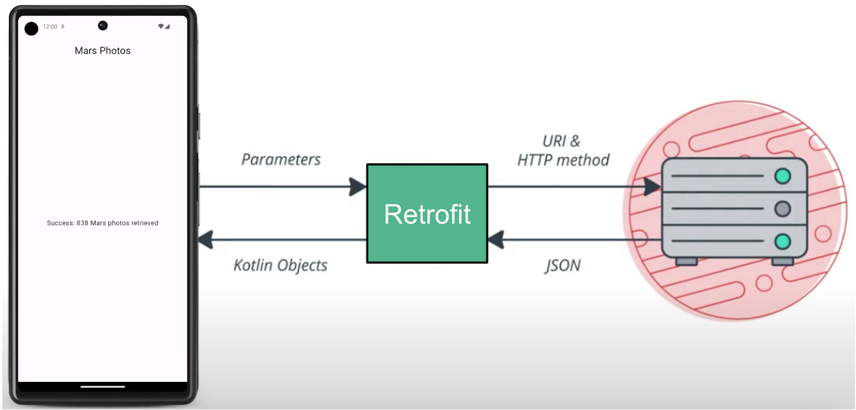

# Retrofit

## Cómo agregar dependencias de Retrofit
### Android Gradle te permite agregar bibliotecas externas a tu proyecto. Además de la dependencia de la biblioteca, también debes incluir el repositorio en el que se aloja.

1. Abre el archivo de Gradle de nivel de módulo build.gradle.kts (Module :app).
2. En la sección dependencies, agrega las siguientes líneas para las bibliotecas Retrofit:

    1. // Retrofit  
    `implementation("com.squareup.retrofit2:retrofit:2.9.0")`
    2. // Retrofit with Scalar Converter
    `implementation("com.squareup.retrofit2:converter-scalars:2.9.0")`

### Las dos bibliotecas funcionan juntas. La primera dependencia es para la biblioteca Retrofit2 y la segunda es para el conversor escalar de Retrofit. Retrofit2 es la versión actualizada de la biblioteca de Retrofit. Este conversor escalar permite que Retrofit muestre el resultado JSON como String. JSON es un formato para almacenar y transportar datos entre el cliente y el servidor.

## Crear el servicio de Retrofit
### ApiService.kt
Define una interfaz donde describirás las peticiones HTTP.

    import retrofit2.http.GET
    import retrofit2.http.Path
    import retrofit2.Call
    
    interface ApiService {
        @GET("posts")
        suspend fun getPosts(): List<Post>
        
        @GET("posts/{id}")
        suspend fun getPostById(@Path("id") id: Int): Post
    }

## Crear el modelo de datos
### Post.kt
Crea una clase de datos que represente el objeto que recibirás de la API.

    data class Post(
        val userId: Int,
        val id: Int,
        val title: String,
        val body: String
    )

## Configurar Retrofit
### RetrofitInstance.kt
Crea un objeto para configurar Retrofit y crear la instancia del servicio.

import retrofit2.Retrofit
import retrofit2.converter.gson.GsonConverterFactory

    object RetrofitInstance {
        private const val BASE_URL = "https://jsonplaceholder.typicode.com/"
        
        val api: ApiService by lazy {
            Retrofit.Builder()
                .baseUrl(BASE_URL)
                .addConverterFactory(GsonConverterFactory.create())
                .build()
                .create(ApiService::class.java)
        }
    }

## Por lo general se hace un viewModel para manejar la llamada a Retrofit y proporcionar los datos a la interfaz de usuario.

    import androidx.lifecycle.ViewModel
    import androidx.lifecycle.viewModelScope
    import kotlinx.coroutines.launch
    import kotlinx.coroutines.flow.MutableStateFlow
    import kotlinx.coroutines.flow.StateFlow
    
    class PostViewModel : ViewModel() {
        private val _posts = MutableStateFlow<List<Post>>(emptyList())
        val posts: StateFlow<List<Post>> get() = _posts
        
        init {
            fetchPosts()
        }
    
        private fun fetchPosts() {
            viewModelScope.launch {
                try {
                    val fetchedPosts = RetrofitInstance.api.getPosts()
                    _posts.value = fetchedPosts
                } catch (e: Exception) {
                    // Manejar el error
                    _posts.value = emptyList()
                }
            }
        }
    }

 

# SQLite
## Las APIs que necesitarás para utilizar una base de datos en Android están disponibles en el paquete **android.database.sqlite.**
## Cómo definir un esquema y un contrato 

    object FeedReaderContract {
        // Table contents are grouped together in an anonymous object.
        object FeedEntry : BaseColumns {
            const val TABLE_NAME = "entry"
            const val COLUMN_NAME_TITLE = "title"
            const val COLUMN_NAME_SUBTITLE = "subtitle"
        }
    }
## Cómo crear una base de datos con un asistente de SQL
### Una vez que hayas definido el aspecto de tu base de datos, debes implementar métodos que creen y mantengan la base de datos y las tablas.

    private const val SQL_CREATE_ENTRIES =
            "CREATE TABLE ${FeedEntry.TABLE_NAME} (" +
                    "${BaseColumns._ID} INTEGER PRIMARY KEY," +
                    "${FeedEntry.COLUMN_NAME_TITLE} TEXT," +
                    "${FeedEntry.COLUMN_NAME_SUBTITLE} TEXT)"
    
    private const val SQL_DELETE_ENTRIES = "DROP TABLE IF EXISTS ${FeedEntry.TABLE_NAME}"
### Si deseas usar SQLiteOpenHelper, crea una subclase que anule los métodos de devolución de llamada onCreate() y onUpgrade().

    class FeedReaderDbHelper(context: Context) : SQLiteOpenHelper(context, DATABASE_NAME, null, DATABASE_VERSION) {
        override fun onCreate(db: SQLiteDatabase) {
            db.execSQL(SQL_CREATE_ENTRIES)
        }
        override fun onUpgrade(db: SQLiteDatabase, oldVersion: Int, newVersion: Int) {
            // This database is only a cache for online data, so its upgrade policy is
            // to simply to discard the data and start over
            db.execSQL(SQL_DELETE_ENTRIES)
            onCreate(db)
        }
        override fun onDowngrade(db: SQLiteDatabase, oldVersion: Int, newVersion: Int) {
            onUpgrade(db, oldVersion, newVersion)
        }
        companion object {
            // If you change the database schema, you must increment the database version.
            const val DATABASE_VERSION = 1
            const val DATABASE_NAME = "FeedReader.db"
        }
    }
## Cómo ingresar información en una base de datos

    // Gets the data repository in write mode
    val db = dbHelper.writableDatabase
    
    // Create a new map of values, where column names are the keys
    val values = ContentValues().apply {
        put(FeedEntry.COLUMN_NAME_TITLE, title)
        put(FeedEntry.COLUMN_NAME_SUBTITLE, subtitle)
    }
    
    // Insert the new row, returning the primary key value of the new row
    val newRowId = db?.insert(FeedEntry.TABLE_NAME, null, values)

## Cómo leer información de una base de datos

    val db = dbHelper.readableDatabase
    
    // Define a projection that specifies which columns from the database
    // you will actually use after this query.
    val projection = arrayOf(BaseColumns._ID, FeedEntry.COLUMN_NAME_TITLE, FeedEntry.COLUMN_NAME_SUBTITLE)
    
    // Filter results WHERE "title" = 'My Title'
    val selection = "${FeedEntry.COLUMN_NAME_TITLE} = ?"
    val selectionArgs = arrayOf("My Title")
    
    // How you want the results sorted in the resulting Cursor
    val sortOrder = "${FeedEntry.COLUMN_NAME_SUBTITLE} DESC"
    
    val cursor = db.query(
            FeedEntry.TABLE_NAME,   // The table to query
            projection,             // The array of columns to return (pass null to get all)
            selection,              // The columns for the WHERE clause
            selectionArgs,          // The values for the WHERE clause
            null,                   // don't group the rows
            null,                   // don't filter by row groups
            sortOrder               // The sort order
    )

    val itemIds = mutableListOf<Long>()
    with(cursor) {
        while (moveToNext()) {
            val itemId = getLong(getColumnIndexOrThrow(BaseColumns._ID))
            itemIds.add(itemId)
        }
    }
    cursor.close()
## Cómo borrar información de una base de datos
    // Define 'where' part of query.
    val selection = "${FeedEntry.COLUMN_NAME_TITLE} LIKE ?"
    // Specify arguments in placeholder order.
    val selectionArgs = arrayOf("MyTitle")
    // Issue SQL statement.
    val deletedRows = db.delete(FeedEntry.TABLE_NAME, selection, selectionArgs)

## Cómo actualizar una base de datos
    val db = dbHelper.writableDatabase
    
    // New value for one column
    val title = "MyNewTitle"
    val values = ContentValues().apply {
        put(FeedEntry.COLUMN_NAME_TITLE, title)
    }
    
    // Which row to update, based on the title
    val selection = "${FeedEntry.COLUMN_NAME_TITLE} LIKE ?"
    val selectionArgs = arrayOf("MyOldTitle")
    val count = db.update(
            FeedEntry.TABLE_NAME,
            values,
            selection,
            selectionArgs)
